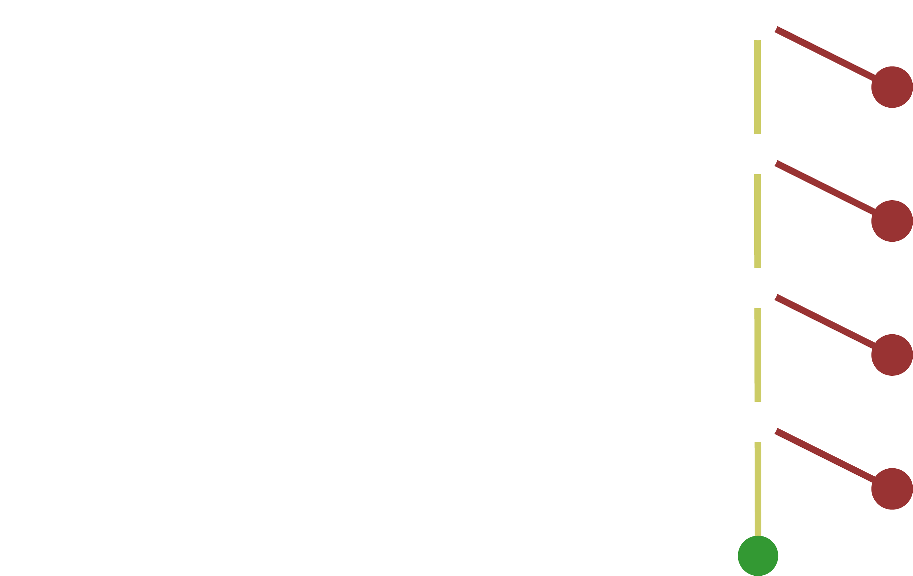

<div class="logo">

</div>

## Cleaning up your code
### The low hanging fruit

---

## Thanks to

- Jeff Bay <span class="gray">Object Calisthenics (2008)</span>
- Rafael Dohms <span class="gray">Object Calisthenics for PHP</span>
- Jeffrey Way <span class="gray">Laracasts</span>

---

## Refactoring

Small steps to better code

---

## Goals

- Readability
- More stable		|
- Maintainabiliy	|
- Better testable	|
- DRYer				|

---

## Goals

- <span class="special">Re</span>adability
- <span class="special">M</span>ore stabl<span class="special">e</span>
- <span class="special">M</span>aintainabiliy
- <span class="special">Be</span>tter testable
- D<span class="special">R</span>Yer

---

### #1 Keep your classes (and methods) small

---

### #2 One level of indentation

```php
function doSomethingWithTheItemList($items) {

	foreach ($items as $item) {
		if( ! $item->published) {
			continue;
		}

		$this->doSomethingWithTheItem($item);
	}

}
```
<!-- .element: class="fragment" -->

---

### #3 Do not use else

- Golden path	|

---


---



---

### #3 Do not use else

- Golden path
- No else after return	|

---

```php
function getPublishedText($article) {

	if ( $article->published) {
		return 'Yes, it is published';
	} else {
		return 'No, not published';
	}

}
```

---

```php
function getPublishedText($article) {

	if ( $article->published) {
		return 'Yes, it is published';
	}

	return 'No, not published';

}
```

---

### #3 Do not use else

- Golden path
- No else after return
- Return early |

---

```php
function getStatusText($status) {

	if ($status == -2) {
		$result = 'Archived';
	} else if ($status == -1) {
		$result = 'Trashed';
	} else if ($status == 0) {
		$result = 'Unpublished';
	} esle {
		$result = 'Published';
	}

	return $result;

}
```

---

```php
function getStatusText($status) {

	if ($status == -2) {
		return 'Archived';
	}

	if ($status == -1) {
		return 'Trashed';
	}

	if ($status == 0) {
		return 'Unpublished';
	}

	return 'Published';

}
```

---

### #3 Do not use else

- Golden path
- No else after return
- Return early
- Defensive (negative) checks |

---

```php
function getPublishedText($article) {

	if ( $article->published) {
		return 'Yes, it is published';
	}

	return 'No, not published';

}
```

---

```php
function getPublishedText($article) {

	if ( ! $article->published) {
		return 'No, not published';
	}

	return 'Yes, it is published';

}
```

---

```php
function getList() {

	$items = $articles->getItems();

	if ( ! empty($items)) {
		foreach ($items as $item) {
			// A lot of code;
		}
	} else {
		throw new Exception('No items found!');
	}

}
```

---

```php
function getList() {

	$items = $articles->getItems();

	if ( empty($items)) {
		throw new Exception('No items found!');
	} else {
		foreach ($items as $item) {
			// A lot of code;
		}
	}

}
```

---

```php
function getList() {

	$items = $articles->getItems();

	if ( empty($items)) {
		throw new Exception('No items found!');
	}

	foreach ($items as $item) {
		// A lot of code;
	}

}
```

---

### #3 Do not use else

- Golden path
- No else after return
- Return early
- Defensive (negative) checks
- Many else-ifs => Switches |

---

```php
function getStatusText($status) {

	if ($status == -2) {
		$result = 'Archived';
	} else if ($status == -1) {
		$result = 'Trashed';
	} else if ($status == 0) {
		$result = 'Unpublished';
	} else {
		$result = 'Published';
	}

	return $result;

}
```

---

```php
function getStatusText($status) {

	if ($status == -2) {
		return 'Archived';
	}

	if ($status == -1) {
		return 'Trashed';
	}

	if ($status == 0) {
		return 'Unpublished';
	}

	return 'Published';

}
```

---

```php
function getStatusText($status) {

	switch ($status) {

		case -2:
			return 'Archived';

		case -1:
			return 'Trashed';

		case 0:
			return 'Unpublished';

		case 1:
		default:
			return 'Published';

	}

}
```

---

### #3 Do not use else

- Golden path
- No else after return
- Return early
- Defensive (negative) checks
- Many else-ifs => Switches
- Move checks to a separate method |

---

```php
function getList() {

	$items = $articles->getItems();

	if ( empty($items)) {
		throw new Exception('No items found!');
	}

	foreach ($items as $item) {
		// A lot of code;
	}

}
```

---

```php
function getList() {

	$items = $articles->getItems();

	if ( empty($items)) {
		throw new Exception('No items found!');
	}

	foreach ($items as $item) {
		$this->prepareItem($item);
	}

}

function prepareItem($item) {
	// A lot of code;
}
```

---

### #4 Do not abbreviate

<div class="align-left">
<div><code>$val</code> => <code>$value</code></div><!-- .element: class="fragment" -->
<div><code>$w</code>, <code>$h</code> => <code>$width</code>, <code>$height</code></div><!-- .element: class="fragment" -->
<div><code>getArtAttrDb()</code> => <code>getArticleAttributesFromDatabase()</code></div><!-- .element: class="fragment" -->
<code>$sp</code><!-- .element: class="fragment" -->
<div>=> <code>$systemPlugin</code> ???</div><!-- .element: class="fragment" -->
<div>=> <code>$serviceProvider</code> ???</div><!-- .element: class="fragment" -->
<div>=> <code>$spain</code> ???</div><!-- .element: class="fragment" -->
<div>=> <code>$stupidPhrase</code> ???</div><!-- .element: class="fragment" -->

<div><br />Exceptions:</div><!-- .element: class="fragment" -->
<div><code>id</code> for identifier</div><!-- .element: class="fragment" -->
<div><code>x</code>, <code>y</code> for actual axis</div><!-- .element: class="fragment" -->
</div>

---

### #4 Do not abbreviate

```php
foreach ($items as $i => $v) {
	echo '<p>' . $i . ': ' . $v;
}
```
<!-- .element: class="fragment" -->
```php
foreach ($items as $key => $value) {
	echo '<p>' . $key . ': ' . $value;
}
```
<!-- .element: class="fragment" -->
```php
foreach ($items as $number => $name) {
	echo '<p>' . $number . ': ' . $name;
}
```
<!-- .element: class="fragment" -->
