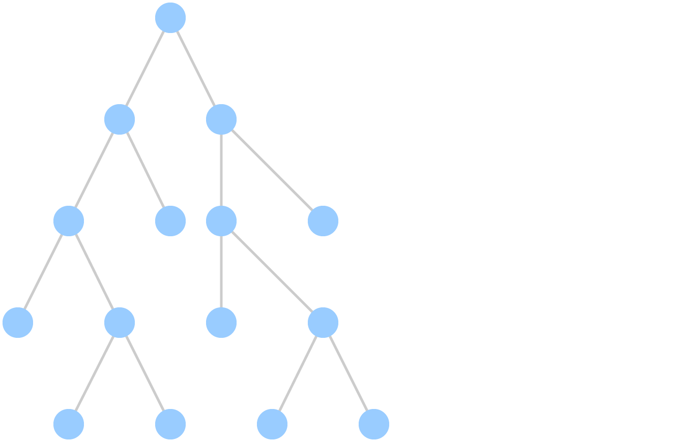

<div class="logo">

</div>

## Cleaning up your code
### The low hanging fruit


---

## Thanks to

- Jeff Bay <span class="gray">Object Calisthenics (2008)</span>
- Rafael Dohms <span class="gray">Object Calisthenics for PHP</span>
- Jeffrey Way <span class="gray">Laracasts</span>

---

### Small steps to better code


---

## Goals

- Readability
- More stable		|
- Maintainabiliy	|
- Better testable	|
- DRYer				|

---

## Goals

- <span class="special">Re</span>adability
- <span class="special">M</span>ore stabl<span class="special">e</span>
- <span class="special">M</span>aintainabiliy
- <span class="special">Be</span>tter testable
- D<span class="special">R</span>Yer

---

### #1 Do not abbreviate


---

### #1 Do not abbreviate

<div class="align-left">
<span><code>$val</code></span><span> => <code>$value</code></span><!-- .element: class="fragment" -->
<span><br><code>$i</code></span><!-- .element: class="fragment" --><span> => <code>$key</code>, <code>$count</code></span><!-- .element: class="fragment" -->
<span><br><code>$w</code>, <code>$h</code></span><!-- .element: class="fragment" --><span> => <code>$width</code>, <code>$height</code></span><!-- .element: class="fragment" -->
<span><br><code>getArtAttrDb()</code></span><!-- .element: class="fragment" --><span> => <code>getArticleAttributesFromDatabase()</code></span><!-- .element: class="fragment" -->
<span><br><code>$sp</code><!-- .element: class="fragment" -->
<span> => <code>$systemPlugin</code> ???</span><!-- .element: class="fragment" -->
<span><code>$serviceProvider</code> ???</span><!-- .element: class="fragment" -->
<span><br> &nbsp; <code>$spain</code> ???</span><!-- .element: class="fragment" -->
<span><code>$stupidPhrase</code> ???</span><!-- .element: class="fragment" -->
</span>
<span><br><br>Exceptions:</span><!-- .element: class="fragment" -->
<span><br><code>id</code> for identifier</span><!-- .element: class="fragment" -->
<span><br><code>x</code>, <code>y</code> for actual axis</span><!-- .element: class="fragment" -->
<span> => <code>x_axis</code>, <code>y_axis</code></span><!-- .element: class="fragment" -->
</div>

---

```php
for ($yi = $skip; $yi < $n_to - $endskip; $yi++)
{
	$line = $to_lines[$yi];
	if ($this->ychanged[$yi] = empty($xhash[$line]))
	{
		continue;
	}
	$yhash[$line] = 1;
	$this->yv[] = $line;
	$this->yind[] = $yi;
}
```

---
```php
if ($mr >= 0) {
	$item->css_markups['timeframe'][]
		= $ra_css_classes[$mr];

	$item->ecss_markups['timeframe'][]
		= ' mu_ra_timeframe'
		. (
			$mu_addtext_radded
			? ' mu_has_text'
			: ''
		);

	$item->title_markups['timeframe'][]
		= $mu_addtext_radded
		? $ra_timeframe_text[$mr]
		: '';
}
```

---

```php
foreach ($items as $i => $v) {
	echo '<p>' . $i . ': ' . $v;
}
```

```php
foreach ($items as $key => $value) {
	echo '<p>' . $key . ': ' . $value;
}
```
<!-- .element: class="fragment" -->
```php
foreach ($items as $number => $name) {
	echo '<p>' . $number . ': ' . $name;
}
```
<!-- .element: class="fragment" -->

---

### #2 Keep your classes (and methods) small


---

### #3 One level of indentation


---

<div>modules/mod_articles_category/helper.php</div>

<div class="smaller-code-4"></div>

```php
switch ($mode) {
	case 'dynamic' :
		$option = $app->input->get('option');
		$view   = $app->input->get('view');

		if ($option === 'com_content') {
			switch ($view) {
				case 'category' :
					$catids = array($app->input->getInt('id'));
					break;
				case 'categories' :
					$catids = array($app->input->getInt('id'));
					break;
				case 'article' :
					if ($params->get('show_on_article_page', 1)) {
						$article_id = $app->input->getInt('id');
						$catid      = $app->input->getInt('catid');

						if (!$catid) {
							$article = JModelLegacy::getInstance('Article', 'ContentModel', array('ignore_request' => true));

							$item   = $article->getItem();
							$catids = array($item->catid);
						} else {
							$catids = array($catid);
						}
					} else {
						return;
					}
					break;

				case 'featured' :
				default:
					return;
			}
		} else {
			return;
		}

		break;

	case 'normal' :
	default:
		$catids = $params->get('catid');
		$articles->setState('filter.category_id.include', (bool) $params->get('category_filtering_type', 1));
		break;
}
```
---

<div>modules/mod_articles_category/helper.php</div>

<div class="smaller-code-5"></div>

```php
if ($catids)
{
	if ($params->get('show_child_category_articles', 0) && (int) $params->get('levels', 0) > 0)
	{
		// Get an instance of the generic categories model
		$categories = JModelLegacy::getInstance('Categories', 'ContentModel');
		$levels = $params->get('levels', 1) ?: 9999;
		$additional_catids = array();

		foreach ($catids as $catid)
		{
			$categories->setState('filter.parentId', $catid);
			$recursive = true;
			$items     = $categories->getItems($recursive);

			if ($items)
			{
				foreach ($items as $category)
				{
					$condition = (($category->level - $categories->getParent()->level) <= $levels);

					if ($condition)
					{
						$additional_catids[] = $category->id;
					}
				}
			}
		}

		$catids = array_unique(array_merge($catids, $additional_catids));
	}

	$articles->setState('filter.category_id', $catids);
}
```

---

```php
function doSomethingWithTheItemList($items) {

	foreach ($items as $item) {
		// Level 1

		if( ! $item->published) {
			// Level 2

			continue;
		}

		$this->doSomethingWithTheItem($item);
	}

}
```

---



---


---


---

### #4 Do not use else


---

### #4 Do not use else

- No else after return

---

```php
function getPublishedText($article) {

	if ( $article->published) {
		return 'Yes, it is published';
	} else {
		return 'No, not published';
	}

}
```

---

```php
function getPublishedText($article) {

	if ( $article->published) {
		return 'Yes, it is published';
	}

	return 'No, not published';

}
```

---

### #4 Do not use else

- No else after return
- Return early

---

```php
function getStatusText($status) {

	if ($status == -2) {
		$result = 'Archived';
	} else if ($status == -1) {
		$result = 'Trashed';
	} else if ($status == 0) {
		$result = 'Unpublished';
	} else {
		$result = 'Published';
	}

	return $result;

}
```

---

```php
function getStatusText($status) {

	if ($status == -2) {
		return 'Archived';
	}

	if ($status == -1) {
		return 'Trashed';
	}

	if ($status == 0) {
		return 'Unpublished';
	}

	return 'Published';

}
```

---

```php
function getList() {

	$items = $articles->getItems();

	foreach ($items as $i => $item) {
		if($item->published) {
			// Do something with the $item
		} else {
			unset($items[$i]);
		}
	}

}
```

---

```php
function getList() {

	$items = $articles->getItems();

	foreach ($items as $i => $item) {
		if($item->published) {
			// Do something with the $item

			continue;
		}

		unset($items[$i]);
	}

}
```

---

```php
function getList() {

	$items = $articles->getItems();

	foreach ($items as $i => $item) {
		if( ! $item->published) {
			unset($items[$i]);

			continue;
		}

		// Do something with the $item
	}

}
```

---

### #4 Do not use else

- No else after return
- Return early
- Defensive (negative) checks

---

```php
function getPublishedText($article) {

	if ( $article->published) {
		return 'Yes, it is published';
	}

	return 'No, not published';

}
```

---

```php
function getPublishedText($article) {

	if ( ! $article->published) {
		return 'No, not published';
	}

	return 'Yes, it is published';

}
```

---

```php
function getList() {

	$items = $articles->getItems();

	if ( ! empty($items)) {
		foreach ($items as $item) {
			// A lot of code;
		}
	} else {
		throw new Exception('No items found!');
	}

}
```

---

```php
function getList() {

	$items = $articles->getItems();

	if ( empty($items)) {
		throw new Exception('No items found!');
	} else {
		foreach ($items as $item) {
			// A lot of code;
		}
	}

}
```

---

```php
function getList() {

	$items = $articles->getItems();

	if ( empty($items)) {
		throw new Exception('No items found!');
	}

	foreach ($items as $item) {
		// A lot of code;
	}

}
```

---

### #4 Do not use else

- No else after return
- Return early
- Defensive (negative) checks
- Move code to separate methods

---

```php
function getList() {

	$items = $articles->getItems();

	if ( empty($items)) {
		throw new Exception('No items found!');
	}

	foreach ($items as $item) {
		// A lot of code;
	}

}
```

---

```php
function getList() {

	$items = $articles->getItems();

	if ( empty($items)) {
		throw new Exception('No items found!');
	}

	foreach ($items as $item) {
		$this->prepareItem($item);
	}

}

function prepareItem($item) {
	// A lot of code;
}
```

---

```php
function addGroceries($type) {

	if ($type = 'drinks') {
		$groceries = $this->getDrinks();
	} else if ($type = 'fruit') {
		$groceries = $this->getFruits();
	} else {
		$groceries = $this->getFood();
	}

	// Do stuff with the $groceries

}
```

---

<div class="smaller-code-8"></div>

```php
function addGroceries($type) {

	$groceries = $this->getGroceriesByType();

	// Do stuff with the $groceries

}

function prepareItem($type) {

	if ($type = 'drinks') {
		return $this->getDrinks();
	}

	if ($type = 'fruit') {
		return $this->getFruits();
	}

	return $this->getFood();

}
```

---

### #4 Do not use else

- No else after return
- Return early
- Defensive (negative) checks
- Move code to separate methods
- Many else-ifs => Switches

---

<div class="smaller-code-8"></div>

```php
function addGroceries($type) {

	$groceries = $this->getGroceriesByType();

	// Do stuff with the $groceries

}

function prepareItem($type) {

	if ($type = 'drinks') {
		return $this->getDrinks();
	}

	if ($type = 'fruit') {
		return $this->getFruits();
	}

	return $this->getFood();

}
```

---

<div class="smaller-code-8"></div>

```php
function addGroceries($type) {

	$groceries = $this->getGroceriesByType();

	// Do stuff with the $groceries

}

function prepareItem($type) {

	switch ($type) {
		case 'drinks':
			return $this->getDrinks();

		case 'fruit':
			return $this->getFruits();

		default:
			return $this->getFood();
	}

}
```

---

```php
function getStatusText($status) {

	if ($status == -2) {
		$result = 'Archived';
	} else if ($status == -1) {
		$result = 'Trashed';
	} else if ($status == 0) {
		$result = 'Unpublished';
	} else {
		$result = 'Published';
	}

	return $result;

}
```

---

```php
function getStatusText($status) {

	if ($status == -2) {
		return 'Archived';
	}

	if ($status == -1) {
		return 'Trashed';
	}

	if ($status == 0) {
		return 'Unpublished';
	}

	return 'Published';

}
```

---

```php
function getStatusText($status) {

	switch ($status) {

		case -2:
			return 'Archived';

		case -1:
			return 'Trashed';

		case 0:
			return 'Unpublished';

		case 1:
		default:
			return 'Published';

	}

}
```

---

```php
function getStatusText($status) {

	if ($status == -2) {
		return 'Archived';
	}

	if ($status == -1) {
		return 'Trashed';
	}

	if ($status == 0) {
		return 'Unpublished';
	}

	return 'Published';

}
```

---

```php
function getStatusText($status) {

	switch ($status) {

		case -2:
			return 'Archived';

		case -1:
			return 'Trashed';

		case 0:
			return 'Unpublished';

		case 1:
		default:
			return 'Published';

	}

}
```

---

### Peter van Westen
#### Regular Labs
#### RegularLabs.com
#### @RegularLabs
